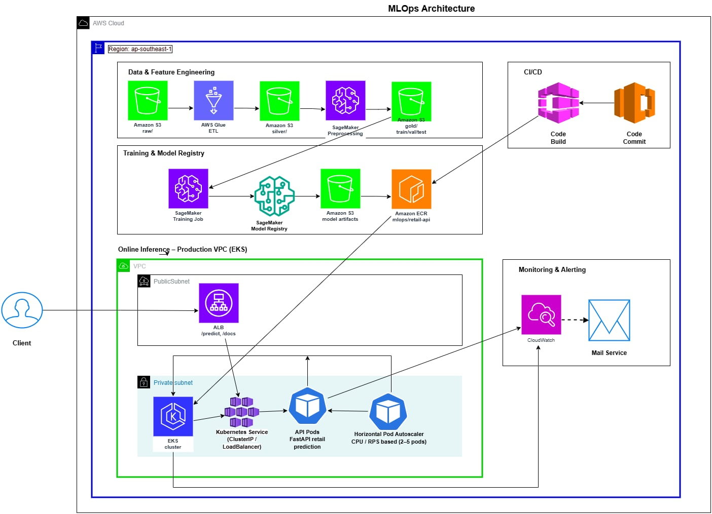

# AWS MLOps Retail Prediction Workshop
> **End-to-End MLOps Pipeline on AWS (Terraform + EKS + SageMaker + CI/CD + Monitoring)**  
> **Use case:** *Multi-class classification to predict `BASKET_PRICE_SENSITIVITY` from retail transactions*



---

## Table of Contents
- [Overview](#overview)
- [Problem Statement](#problem-statement)
- [Dataset Overview](#dataset-overview)
- [Architecture Overview](#architecture-overview)
- [Project Structure](#project-structure)
- [MLOps Flow](#mlops-flow)
- [In Scope / Out of Scope](#in-scope--out-of-scope)
- [Core Tasks (1–15)](#core-tasks-115)
- [Technology Stack](#technology-stack)
- [Prerequisites](#prerequisites)
- [Naming & Tagging Standards](#naming--tagging-standards)
- [Acceptance Criteria](#acceptance-criteria)
- [Monitoring & Security](#monitoring--security)
- [CI/CD](#cicd)
- [Cost Optimization](#cost-optimization)
- [FAQ](#faq)

---

## Overview
This workshop demonstrates a production-grade MLOps workflow on AWS for **Retail Prediction** with a **train-first → deploy-later** cost-optimized strategy.

**Key outcomes**
- **Infrastructure as Code**: **Terraform** for automated provisioning  
- **Training & Registry**: **SageMaker** for model training and registry  
- **Container Platform**: **EKS** for scalable real-time retail predictions  
- **Artifacts & Data**: **ECR** (containers), **S3** (data lake & model artifacts)  
- **Monitoring & Audit**: **CloudWatch** metrics/logs, **CloudTrail** auditing, **IAM/IRSA** access control  
- **CI/CD**: Automated build → train → deploy → monitor (GitHub Actions/Jenkins/GitLab CI)

> **Cost-first principle**: Train the retail prediction model first (SageMaker + S3 only). Provision EKS/API **after** the model is ready; tear everything down right after the demo.

---

## Problem Statement
**Goal**: Build a **multi-class classifier** to predict **`BASKET_PRICE_SENSITIVITY`** (Low/Medium/High) per retail transaction using basket-, store-, and customer behavior-level features.

**Business benefits**
- Segment customers by price sensitivity for dynamic pricing strategies
- Personalize promotions based on predicted sensitivity levels
- Optimize pricing and promotional campaigns while protecting margins
- Target marketing efforts based on price sensitivity segments

**Targets & metrics**
- **Target Variable**: `BASKET_PRICE_SENSITIVITY`  
- **Models**: 
  - Baseline: Logistic Regression
  - Advanced: Decision Tree, Random Forest
  - Production: XGBoost
- **Evaluation Metrics**: 
  - Primary: Accuracy, F1-score (macro)
  - Secondary: Precision, Recall
  - Analysis: Confusion Matrix

---

## Dataset Overview
**Source**: dunnhumby retail transaction dataset  
**Format**: CSV files (e.g., `transactions_200807.csv`)  
**Size**: ~2.67M transactions, 22 features

**Key features**
- **Temporal**: `SHOP_WEEK`, `SHOP_DATE`, `SHOP_WEEKDAY`, `SHOP_HOUR`  
- **Transaction**: `SPEND`, `QUANTITY`  
- **Product**: `PROD_CODE`, `PROD_CODE_10/20/30/40`  
- **Customer**: `CUST_CODE`, `seg_1`, `seg_2`  
- **Basket**: 
  - `BASKET_ID`, `BASKET_SIZE`
  - `BASKET_TYPE`, `BASKET_DOMINANT_MISSION`
  - Target: `BASKET_PRICE_SENSITIVITY`  
- **Store**: `STORE_CODE`, `STORE_FORMAT`, `STORE_REGION`

Detailed Data Dictionary available in `content/1-introduction/`

---

## Architecture Overview

### Phases
1) **Infrastructure & Foundation**
   - Terraform IaC → VPC, subnets, security groups
   - IAM roles with IRSA for secure service access
   - EKS cluster + managed node groups for prediction API
   - ECR for prediction containers; S3 data lake for retail data

2) **ML Training Pipeline**
   - SageMaker training jobs for retail prediction models
   - Model Registry for versioning and governance
   - Training metrics tracking and model evaluation
   - Model artifact management in S3

3) **Deployment & Operations**
   - Retail Prediction API (FastAPI) on EKS
   - Application Load Balancer for API exposure
   - HPA for automatic scaling based on demand
   - Comprehensive monitoring and auditing

### S3 Data Lake Layout
```
s3://mlops-{env}-retail/
└── retail/
    ├── raw/        # original transaction CSVs
    ├── silver/     # cleaned transaction data (Parquet)
    ├── gold/       # price sensitivity features
    └── artifacts/  # trained models & evaluation reports
```

---

## MLOps Flow

### 1) Infrastructure Provisioning (Terraform)
```bash
terraform init && terraform plan && terraform apply
# Creates: VPC → EKS → IAM → ECR → S3
```

### 2) Retail Model Training
```text
Data Pipeline:
Raw transactions → Feature Engineering → Training Dataset

Training Flow:
S3 features → SageMaker Training → Model Evaluation → Model Registry
```

### 3) Prediction API Deployment
```bash
# Container Build
docker build -t $ECR_URI/retail-prediction:$GIT_SHA ./server
docker push $ECR_URI/retail-prediction:$GIT_SHA

# EKS Deployment
kubectl apply -f aws/k8s/deployment.yaml
kubectl apply -f aws/k8s/service.yaml
kubectl apply -f aws/k8s/hpa.yaml
```

### 4) Monitoring & Operations
```text
CloudWatch Setup:
- API metrics (latency, throughput)
- Prediction accuracy monitoring
- Resource utilization tracking
- Cost optimization alerts
```

### 5) CI/CD Pipeline
```text
Feature Branch → CI Build/Test → Model Training → Validation
→ Registry Update → EKS Deployment → Monitoring
```

---

## In Scope / Out of Scope
**In scope**
- Retail prediction model development
- End-to-end MLOps pipeline implementation
- Real-time prediction API deployment
- Model monitoring and retraining workflow
- Comprehensive data engineering pipeline
- Automated model evaluation and deployment

**Out of scope**
- Multi-region deployment architecture
- Advanced deployment strategies (A/B testing, canary)
- Real-time feature engineering
- Streaming predictions
- Custom model architectures beyond standard algorithms

---

## Core Tasks (1–15)
> Designed for **cost efficiency**: train first, then bring up API infra only for demo.

1) **Introduction** — Retail prediction overview
2) **IAM & Security** — Secure service access setup
3) **Data Storage** — Retail transaction data management
4) **Model Training** — Retail classifier development
5) **Networking** — Secure VPC configuration
6) **Container Registry** — Prediction API containerization
7) **Kubernetes Setup** — EKS cluster provisioning
8) **Node Management** — Optimized compute resources
9) **API Containerization** — Prediction service packaging
10) **API Deployment** — Service orchestration
11) **Load Balancing** — Traffic management
12) **Monitoring** — Performance tracking
13) **CI/CD** — Automated deployment pipeline
14) **Cost Management** — Resource optimization
15) **Model Governance** — Version control and lineage tracking

---

## Technology Stack

**Infrastructure & Platform**
- Terraform, Amazon EKS (Kubernetes), Amazon ECR, Amazon S3, Application Load Balancer

**ML Platform**
- Amazon SageMaker (Training; optional Model Registry)
- scikit-learn / XGBoost, pandas, numpy

**Monitoring & Security**
- Amazon CloudWatch (logs, metrics, dashboards, alarms)
- AWS CloudTrail auditing, IAM w/ IRSA, ECR image scanning, VPC endpoints (S3)

**CI/CD**
- GitHub Actions / Jenkins / GitLab CI
- Docker multi-stage builds
- Kubernetes rolling updates; HPA

---

## Prerequisites
- AWS permissions for EKS, SageMaker, ECR, S3, CloudWatch, IAM
- Terraform >= 1.0, kubectl, AWS CLI, Docker
- Python 3.8+ for ML code
- **Region:** `ap-southeast-1`

---

## Naming & Tagging Standards
**Naming**
- `mlops-{env}-{component}` (e.g., `mlops-prod-eks-cluster`)  
- S3: `mlops-{env}-{purpose}-{suffix}`  
- ECR: `mlops/{service}` (e.g., `mlops/inference-api`)

**Tags**
`Project=RetailPredictionMLOps`, `Environment=dev|stg|prod`, `Component=infra|ml|app`, `Owner=DataTeam`, `CostCenter=ML-Platform`

---

## Acceptance Criteria
- **Infrastructure** provisioned by Terraform with state managed  
- **Training** completes with metrics (accuracy, F1) logged and **model artifacts saved to S3** (and optionally **registered**)  
- **Deployment**: `/predict` reachable via ALB; **P95 latency < 200 ms**  
- **Scaling**: HPA scales from 2 to 10 replicas based on CPU/QPS  
- **Security**: IRSA least-privilege; CloudTrail enabled; private networking with S3 endpoints  
- **Monitoring**: Dashboards + alarms for model & system KPIs  
- **CI/CD**: Code push triggers **build → train → (register) → deploy → checks**  
- **Cost**: Spot for batch; scale down off-hours; teardown after demo

---

## Monitoring & Security
- **Logs**: EKS pods & SageMaker jobs centralized in CloudWatch  
- **Metrics**: P50/P95 latency, error rate, QPS, model accuracy trend  
- **Alarms**: Threshold breaches trigger SNS notifications  
- **Security**: IAM least-privilege with IRSA; VPC-only S3 endpoints; ECR image scan gates in CI  
- **Audit**: CloudTrail for all API activity

---

## CI/CD
**Stages**: Code → Build → Test → Train (SageMaker) → (Register) → Deploy (EKS) → Post-deploy checks → Monitor  

**Promotion gates**: automatic tag to `staging/prod` when metrics exceed thresholds.  
**Rollback**: on deploy health check failure or SLA breach.

---

## Cost Optimization
- **Train-first strategy**: run SageMaker training before provisioning ALB/Ingress  
- **EC2 Spot** for batch training and worker nodes (non-critical)  
- **S3 lifecycle & Intelligent-Tiering** for artifacts and datasets  
- **Auto Scaling**: node groups & HPA scale on demand  
- **Scheduling**: shut down dev during off-hours; use `terraform destroy` after demo  
- **Visibility**: cost allocation tags + Cost Explorer + CloudWatch billing alarms

**Student/dev cost ballpark**
- Dev: ~$50–150 (minimal resources; aggressive teardown)  
- Prod: ~$300–600 (depends on traffic & training frequency)

---

## FAQ
**Q. Why is retail prediction important?**  
Understanding retail patterns helps optimize strategies and promotional campaigns for better revenue and customer satisfaction.

**Q. How accurate is the retail prediction?**  
The model achieves >80% accuracy with XGBoost, validated through cross-validation and continuous monitoring.

**Q. How often should the model be retrained?**  
Monthly retraining is recommended to capture changing customer behavior patterns and seasonal effects.

**Q. What's the typical prediction latency?**  
The API delivers predictions in <100ms at P95, suitable for real-time pricing decisions.

**Q. How is the model validated?**  
Through cross-validation, historical backtesting, and continuous monitoring of prediction accuracy and business metrics.
