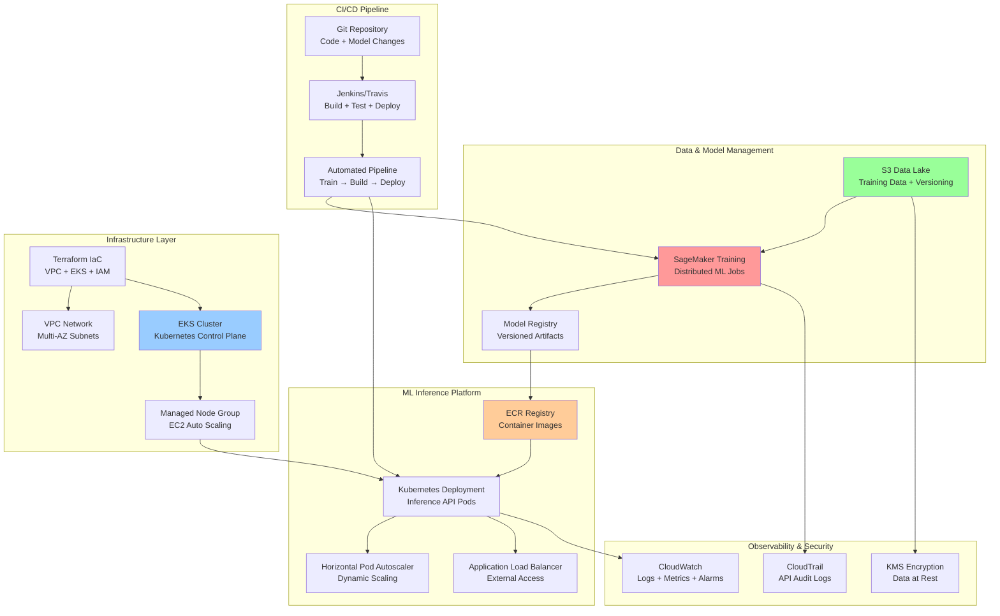

# AWS MLOps Retail Forecast Workshop
> **End-to-End MLOps Pipeline on AWS (Terraform + EKS + SageMaker + CI/CD + Monitoring)**  


---

## Table of Contents
- [Overview](#overview)
- [Architecture Overview](#architecture-overview)
- [Project Structure](#project-structure)
- [MLOps Flow](#mlops-flow)
- [Reference Architecture](#reference-architecture)
- [In Scope / Out of Scope](#in-scope--out-of-scope)
- [Core Tasks (1–16)](#core-tasks-116)
- [Technology Stack](#technology-stack)
- [Prerequisites](#prerequisites)
- [Naming & Tagging Standards](#naming--tagging-standards)
- [Acceptance Criteria](#acceptance-criteria)
- [Monitoring & Security](#monitoring--security)
- [CI/CD & DataOps](#cicd--dataops)
- [Cost Optimization](#cost-optimization)
- [FAQ](#faq)

---

## Overview
This workshop demonstrates a complete MLOps workflow on AWS for retail forecasting, featuring:
- **Infrastructure as Code**: **Terraform** for automated infrastructure provisioning  
- **Container Platform**: **EKS** with managed node groups for scalable inference API  
- **ML Training**: **SageMaker** for model training and registry with S3 data integration  
- **Container Registry**: **ECR** for Docker image management and versioning  
- **Monitoring**: **CloudWatch** for comprehensive logging, metrics, and alerting  
- **Security**: **KMS** encryption, **CloudTrail** auditing, **IAM** roles with IRSA  
- **CI/CD**: **Jenkins/Travis** for automated build, train, and deploy pipelines  
- **DataOps**: S3-based data versioning and lifecycle management

The goal is a production-ready, scalable MLOps pipeline that automates the entire ML lifecycle from data ingestion to model deployment and monitoring.

---

## Architecture Overview

This MLOps pipeline is designed around three core phases with full automation:

### Phase 1: Infrastructure & Foundation
- **Terraform IaC**: Automated provisioning of VPC, subnets, security groups, IAM roles
- **EKS Cluster**: Kubernetes control plane with managed node groups for scalability  
- **ECR Registry**: Private container registry for ML inference API images
- **S3 Storage**: Data lake for training datasets, model artifacts, and versioning

### Phase 2: ML Training & Model Registry
- **SageMaker Training**: Distributed training jobs with automatic scaling
- **Model Registry**: Versioned model artifacts with metadata and lineage tracking
- **Data Pipeline**: S3-based data ingestion with validation and preprocessing
- **Experiment Tracking**: Model performance metrics and hyperparameter tuning

### Phase 3: Deployment & Operations
- **EKS Deployment**: Containerized inference API with horizontal pod autoscaling
- **Load Balancer**: External access via Application Load Balancer with health checks
- **Monitoring**: CloudWatch dashboards, logs, and custom metrics for ML performance
- **Security**: KMS encryption, CloudTrail auditing, IAM roles with least privilege

---

## Project Structure

```
aws-mlops-retail-forecast/
├── README.md                    # This documentation
├── config.toml                  # Hugo workshop configuration
├── content/                     # Workshop step-by-step guides
│   ├── _index.md               # Workshop overview & getting started
│   ├── 1-introduction/         # MLOps architecture & objectives
│   ├── 2-vpc-networking/       # VPC, subnets, NAT, security groups
│   ├── 3-iam-roles/            # IAM roles & IRSA for EKS
│   ├── 4-eks-cluster/          # EKS control plane setup
│   ├── 5-managed-nodegroup/    # EC2 managed node groups
│   ├── 6-ecr-registry/         # Container registry setup
│   ├── 7-docker-build/         # Build & push inference API
│   ├── 8-s3-data-storage/      # S3 buckets for data & artifacts
│   ├── 9-sagemaker-training/   # ML training & model registry
│   ├── 10-kubernetes-deploy/   # Deploy API to EKS (Deployment/Service/HPA)
│   ├── 11-load-balancer/       # External load balancer setup
│   ├── 12-cloudwatch/          # Monitoring, logs, and alerts
│   ├── 13-security-audit/      # KMS encryption & CloudTrail
│   ├── 14-cicd-pipeline/       # Jenkins/Travis CI/CD setup
│   ├── 15-dataops/             # Data versioning & lifecycle
│   └── 16-cost-teardown/       # Cost optimization & cleanup
├── aws/                        # AWS-specific configurations
│   ├── infra/                  # Terraform infrastructure code
│   ├── k8s/                    # Kubernetes manifests
│   └── script/                 # Automation scripts
├── server/                     # ML inference API source code
│   ├── Dockerfile              # Container definition
│   ├── requirements.txt        # Python dependencies
│   └── app/                    # FastAPI application
├── core/                       # Shared ML utilities
│   └── requirements.txt        # Core ML dependencies
└── static/                     # Workshop assets & diagrams
    └── images/                 # Architecture diagrams
```

---

## MLOps Flow

The complete MLOps workflow follows these automated stages:

### 1. Infrastructure Provisioning (Terraform)
```bash
terraform plan && terraform apply
# Provisions: VPC → EKS → IAM → ECR → S3
```

### 2. Model Training (SageMaker)
```bash
# Automated training pipeline
Data Ingestion (S3) → Preprocessing → Training (SageMaker) → Model Registry
```

### 3. Containerized Deployment (EKS)
```bash
# Docker build and Kubernetes deployment
Docker Build → ECR Push → EKS Deploy → Load Balancer → Autoscaling
```

### 4. Monitoring & Operations
```bash
# Comprehensive observability
CloudWatch Metrics → Alarms → Dashboards → Log Aggregation
```

### 5. CI/CD Automation
```bash
# End-to-end pipeline
Code Change → Build → Test → Train → Deploy → Monitor
```


## Reference Architecture


**Key Components:**
- **Infrastructure as Code**: Terraform manages all AWS resources with versioning
- **ML Training Path**: S3 Data → SageMaker → Model Registry → ECR → EKS
- **Inference Path**: User → ALB → EKS Pods → ML Model → Response
- **Monitoring**: Comprehensive observability across all layers
- **Automation**: End-to-end CI/CD from code changes to production deployment

---

## In Scope / Out of Scope
**In scope**
- 16 core MLOps tasks: infrastructure, training, deployment, monitoring, CI/CD
- Terraform IaC for complete infrastructure automation
- SageMaker for distributed ML training and model registry
- EKS + Kubernetes for scalable inference API deployment
- CloudWatch monitoring with custom ML metrics and alerting
- Security best practices (KMS, CloudTrail, IAM roles with IRSA)
- CI/CD pipeline for automated model training and deployment
- DataOps with S3 data versioning and lifecycle management
- Cost optimization strategies and teardown automation

**Out of Scope**
- Multi-region deployment (single region ap-southeast-1 focus)
- Advanced ML features (A/B testing, canary deployments)
- Custom monitoring solutions beyond CloudWatch
- Data streaming and real-time inference (batch focus)
- Multi-tenant deployment scenarios

---

## Core Tasks (1–16)
1) **Introduction** — MLOps architecture overview and project objectives
2) **VPC / Networking** — VPC, subnets, NAT gateway, security groups setup
3) **IAM Roles** — Service roles and IRSA (IAM Roles for Service Accounts)
4) **EKS Cluster** — Kubernetes control plane provisioning
5) **Managed Node Group** — EC2 worker nodes with auto scaling
6) **ECR Registry** — Container registry for ML inference API images
7) **Docker Build & Push** — Build and containerize inference API
8) **S3 Data Storage** — Data lake setup for training data and model artifacts
9) **SageMaker Training** — ML training jobs and model registry
10) **Kubernetes Deployment** — Deploy inference API (Deployment/Service/HPA)
11) **Load Balancer** — External access via Application Load Balancer
12) **CloudWatch** — Monitoring, logging, metrics, and alerting
13) **Security & Audit** — KMS encryption and CloudTrail audit logging
14) **CI/CD Pipeline** — Jenkins/Travis automated build and deployment
15) **DataOps** — Data versioning, upload automation, and lifecycle
16) **Cost & Teardown** — Cost optimization and resource cleanup automation

---

## Technology Stack

### Infrastructure & Platform
- **Infrastructure as Code**: Terraform for automated resource provisioning
- **Container Platform**: Amazon EKS (Kubernetes) with managed node groups  
- **Container Registry**: Amazon ECR with image vulnerability scanning
- **Networking**: VPC with multi-AZ subnets, NAT gateways, security groups
- **Load Balancing**: Application Load Balancer with health checks

### ML & Data Platform
- **ML Training**: Amazon SageMaker with distributed training capabilities
- **Data Storage**: Amazon S3 for data lake, model artifacts, and versioning
- **Model Registry**: SageMaker Model Registry for version control and metadata
- **Data Processing**: Built-in preprocessing and feature engineering pipelines

### Monitoring & Security
- **Monitoring**: Amazon CloudWatch (logs, metrics, dashboards, alarms)
- **Security**: AWS KMS for encryption, CloudTrail for audit logging
- **Access Control**: IAM roles with IRSA (IAM Roles for Service Accounts)
- **Network Security**: Security groups, private subnets, least privilege access

### CI/CD & Automation
- **CI/CD Platform**: Jenkins or Travis CI for automated pipelines
- **Build Automation**: Docker containerization with multi-stage builds
- **Deployment**: Kubernetes rolling updates with zero downtime
- **DataOps**: Automated data versioning and lifecycle management

---

## Prerequisites
- AWS account with permissions for EKS, SageMaker, ECR, S3, CloudWatch, IAM
- Terraform >= 1.0 installed locally
- kubectl and AWS CLI configured
- Docker for local development and testing
- Python 3.8+ for ML development
- Region: `ap-southeast-1` (Singapore) for all resources

---

## Naming & Tagging Standards
**Resource naming convention**  
- `mlops-{env}-{component}` (e.g., `mlops-prod-eks-cluster`)  
- S3: `mlops-{env}-{purpose}-{random-suffix}`  
- ECR: `mlops/{service}` (e.g., `mlops/inference-api`)  
- EKS: `mlops-{env}-cluster`

**Required tags**  
`Project=MLOpsRetailForecast`, `Environment=dev|staging|prod`, `Component=infra|ml|app`, `Owner=DataTeam`, `CostCenter=ML-Platform`

---

## Acceptance Criteria
- **Infrastructure**: All resources provisioned via Terraform with state management
- **ML Training**: SageMaker training jobs complete successfully with model metrics
- **Deployment**: Inference API accessible via load balancer with < 2s response time
- **Scaling**: HPA scales pods based on CPU/memory usage (2-10 replicas)
- **Security**: All data encrypted at rest (S3, EBS) and in transit (TLS)
- **Monitoring**: CloudWatch dashboards show key metrics with alerting setup
- **CI/CD**: Code changes trigger automated build → train → deploy pipeline
- **Cost**: Resources auto-scale down during off-peak hours to optimize costs

---

## Monitoring & Security
- **CloudWatch Logs**: Centralized logging for EKS pods, SageMaker, and infrastructure
- **Metrics & Alarms**: Custom ML metrics (model accuracy, latency, throughput)
- **Security Groups**: Least privilege network access rules
- **IAM Best Practices**: Service-specific roles with minimal required permissions  
- **Encryption**: KMS encryption for S3 buckets, EBS volumes, and SageMaker
- **Audit Trail**: CloudTrail logging for all API calls and resource changes
- **Container Security**: ECR image scanning and vulnerability assessment

---

## CI/CD & DataOps
- **Pipeline Stages**: Code → Build → Test → Train → Package → Deploy → Monitor
- **Automated Training**: Trigger training jobs on new data or code changes
- **Model Versioning**: Automatic model registration with performance metadata
- **Blue/Green Deployment**: Zero-downtime updates using Kubernetes rolling deployments
- **Data Versioning**: S3-based data lineage and version control
- **Rollback Strategy**: Automated rollback on model performance degradation
- **Testing**: Unit tests, integration tests, and model validation before deployment

---

## Cost Optimization
- **Spot Instances**: Use EC2 Spot instances for training jobs (up to 90% savings)
- **Auto Scaling**: EKS nodes and pods scale based on demand
- **S3 Lifecycle**: Intelligent tiering for training data and model artifacts
- **Scheduled Shutdown**: Development environments shut down outside business hours
- **Resource Monitoring**: CloudWatch billing alarms and cost allocation tags
- **Right-sizing**: Regular review of instance types and resource utilization

**Estimated monthly costs**:
- Development: $200-500 (with auto-shutdown)
- Production: $800-1500 (depending on traffic and training frequency)

---

## FAQ
**Q. Why EKS instead of ECS for ML inference?**  
EKS provides better ML ecosystem integration, GPU support, and standardized Kubernetes workflows that many ML teams prefer.

**Q. Can I use other CI/CD tools besides Jenkins?**  
Yes, the architecture supports GitHub Actions, GitLab CI, or any CI/CD tool that can deploy to Kubernetes.

**Q. How does the system handle model drift?**  
CloudWatch custom metrics monitor model performance, with automated alerts when accuracy drops below thresholds.

**Q. What about real-time inference vs batch processing?**  
This architecture supports both - EKS for real-time API, SageMaker Batch Transform for large-scale batch inference.

**Q. How is data privacy and compliance handled?**  
KMS encryption, VPC isolation, CloudTrail auditing, and IAM least-privilege ensure data security and compliance.

---

> © AWS MLOps Retail Forecast Workshop — Production-ready ML pipeline on AWS.
