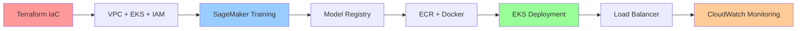

# AWS MLOps Retail Forecast Platform

**AWS MLOps Retail Forecast** là một hệ thống MLOps end-to-end hoàn chỉnh được xây dựng trên AWS Cloud, tự động hóa toàn bộ quy trình từ xây dựng hạ tầng, huấn luyện mô hình, triển khai inference API, đến giám sát và tối ưu chi phí. Dự án được thiết kế để đảm bảo tính mở rộng, độ tin cậy và bảo mật cao cho các ứng dụng Machine Learning trong thực tế.

## Kiến trúc MLOps trên AWS Cloud



### Mục tiêu dự án

**Tự động hóa hoàn toàn quy trình MLOps:**
- 🏗️ **Infrastructure as Code**: Xây dựng hạ tầng tự động bằng Terraform (VPC, EKS, IAM, EC2, ECR, S3)
- 🤖 **ML Training**: Huấn luyện mô hình phân tán trên SageMaker với model registry
- 🚀 **Container Deployment**: Đóng gói & triển khai inference API trên EKS với autoscaling
- 📊 **Monitoring & Security**: Giám sát bằng CloudWatch, bảo mật bằng KMS & CloudTrail
- 🔄 **CI/CD Pipeline**: Pipeline tự động từ thay đổi code/data → build → train → deploy
- 💰 **Cost Optimization**: Tích hợp DataOps và teardown để tối ưu chi phí

### Flow tổng quát



**Infrastructure → Training → Deployment → Monitoring → CI/CD → Cost Optimization**

## Công nghệ sử dụng

### Infrastructure & Platform Stack
- **Infrastructure as Code**: Terraform cho automated provisioning
- **Container Platform**: Amazon EKS (Kubernetes) với managed node groups
- **Container Registry**: Amazon ECR với vulnerability scanning  
- **Networking**: VPC multi-AZ, NAT gateways, security groups
- **Load Balancing**: Application Load Balancer với health checks

### ML & Data Platform Stack  
- **ML Training**: Amazon SageMaker với distributed training
- **Data Storage**: Amazon S3 data lake với versioning
- **Model Registry**: SageMaker Model Registry cho version control
- **Data Processing**: Automated preprocessing và feature engineering
- **ML Framework**: TensorFlow/PyTorch trên SageMaker training jobs

### DevOps & Security Stack
- **CI/CD Platform**: Jenkins hoặc Travis CI cho automated pipelines
- **Monitoring**: CloudWatch (logs, metrics, dashboards, alarms)
- **Security**: KMS encryption, CloudTrail audit, IAM với IRSA
- **DataOps**: S3-based data versioning và lifecycle management

## Kiến trúc MLOps chi tiết

### Phase 1: Infrastructure Foundation

**Terraform Infrastructure as Code**
- VPC với multi-AZ public/private subnets
- EKS cluster với managed node groups (auto-scaling)
- IAM roles với IRSA (IAM Roles for Service Accounts)
- Security groups với least privilege access
- ECR repositories cho container images

**Network Architecture**
- Public subnets: NAT Gateway, Load Balancer
- Private subnets: EKS worker nodes, SageMaker
- VPC endpoints: S3, ECR, CloudWatch (giảm data transfer cost)

### Phase 2: ML Training & Model Management

**SageMaker Training Pipeline**
- **Data Ingestion**: S3 data lake với automated validation
- **Distributed Training**: SageMaker training jobs với spot instances
- **Model Registry**: Versioned model artifacts với metadata tracking
- **Experiment Tracking**: Performance metrics và hyperparameter tuning

**Data Management Strategy**
- Raw data → Processed data → Feature store → Model artifacts
- S3 intelligent tiering cho cost optimization
- Data lineage tracking và version control

### Phase 3: Containerized Inference Platform

**EKS Deployment Architecture**
- **Docker Containers**: FastAPI inference service
- **Kubernetes Deployment**: Rolling updates với zero downtime  
- **Horizontal Pod Autoscaler**: Dynamic scaling dựa trên CPU/memory
- **Service Discovery**: Internal service communication
- **Application Load Balancer**: External access với SSL termination

**Monitoring & Observability**
- **CloudWatch Logs**: Centralized logging từ tất cả components
- **Custom Metrics**: Model performance, latency, throughput
- **Alarms & Notifications**: Automated alerting khi có issues
- **Dashboards**: Real-time visualization của system health

### Phase 4: CI/CD & Automation

**Automated Pipeline Flow**
```bash
1. Code/Data Change → Git Webhook
2. Jenkins/Travis Build → Run Tests
3. SageMaker Training → Model Validation  
4. Docker Build → Push to ECR
5. Kubernetes Deploy → Rolling Update
6. Health Check → Monitor Performance
```

**DataOps Workflow**
- **Data Versioning**: S3 với metadata tracking
- **Data Quality**: Automated validation và testing
- **Feature Engineering**: Reproducible pipelines
- **Model Deployment**: A/B testing capabilities

## Scope & Expected Outcomes

### In Scope
✅ **Complete Infrastructure**: Terraform IaC cho toàn bộ AWS resources  
✅ **ML Training**: SageMaker distributed training với hyperparameter tuning  
✅ **Container Deployment**: EKS với autoscaling và load balancing  
✅ **Security Best Practices**: KMS encryption, CloudTrail audit, IAM least privilege  
✅ **Monitoring & Alerting**: CloudWatch comprehensive monitoring  
✅ **CI/CD Automation**: End-to-end pipeline từ code đến production  
✅ **Cost Optimization**: Auto-scaling, spot instances, lifecycle policies  

### Out of Scope
❌ Multi-region deployment (focus on ap-southeast-1)  
❌ Advanced ML features (A/B testing, canary deployments)  
❌ Real-time streaming inference (batch-focused)  
❌ Custom monitoring solutions (CloudWatch-only)  

### Expected Outcomes
🎯 **Production-Ready MLOps Platform**: Scalable, reliable, cost-effective  
🎯 **Automated ML Lifecycle**: Từ data ingestion đến model deployment  
🎯 **Infrastructure Reproducibility**: Terraform state management  
🎯 **Operational Excellence**: Comprehensive monitoring và alerting  
🎯 **Cost Efficiency**: Optimized resource usage với auto-scaling  

{}
Kiến trúc này được thiết kế để support enterprise-grade ML workloads với khả năng scale từ proof-of-concept đến production với hàng triệu requests/day.
{}

{}
**Prerequisites**: AWS account với permissions cho EKS, SageMaker, ECR, S3, CloudWatch, IAM. Terraform >= 1.0, kubectl, AWS CLI, Docker, Python 3.8+.
{}
