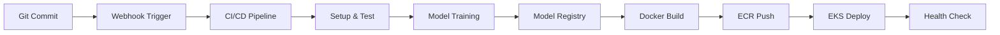

## Mục tiêu

Tự động hoá toàn bộ pipeline MLOps, từ code → build → train → deploy, đảm bảo mỗi thay đổi trong source code hoặc dữ liệu sẽ tự động kích hoạt quá trình cập nhật hệ thống.

## Nội dung chính

### 1. Architecture Overview



### 2. IAM Roles và Permissions

#### 2.1 Create CI/CD Service Role

```bash
# Create trust policy for CI/CD role
cat > cicd-trust-policy.json << EOF
{
  "Version": "2012-10-17",
  "Statement": [
    {
      "Effect": "Allow",
      "Principal": {
        "Service": [
          "ec2.amazonaws.com",
          "codebuild.amazonaws.com",
          "codepipeline.amazonaws.com"
        ]
      },
      "Action": "sts:AssumeRole"
    },
    {
      "Effect": "Allow",
      "Principal": {
        "AWS": "arn:aws:iam::YOUR_ACCOUNT_ID:user/jenkins-user"
      },
      "Action": "sts:AssumeRole"
    }
  ]
}
EOF

# Create the role
aws iam create-role \
  --role-name RetailForecastCICDRole \
  --assume-role-policy-document file://cicd-trust-policy.json \
  --description "Role for Retail Forecast CI/CD Pipeline"
```

#### 2.2 CI/CD IAM Policy

```json
{
  "Version": "2012-10-17",
  "Statement": [
    {
      "Effect": "Allow",
      "Action": [
        "s3:GetObject",
        "s3:PutObject",
        "s3:DeleteObject",
        "s3:ListBucket"
      ],
      "Resource": [
        "arn:aws:s3:::retail-forecast-data-bucket",
        "arn:aws:s3:::retail-forecast-data-bucket/*",
        "arn:aws:s3:::retail-forecast-artifacts-bucket",
        "arn:aws:s3:::retail-forecast-artifacts-bucket/*"
      ]
    },
    {
      "Effect": "Allow",
      "Action": [
        "ecr:GetAuthorizationToken",
        "ecr:BatchCheckLayerAvailability",
        "ecr:GetDownloadUrlForLayer",
        "ecr:BatchGetImage",
        "ecr:PutImage",
        "ecr:InitiateLayerUpload",
        "ecr:UploadLayerPart",
        "ecr:CompleteLayerUpload"
      ],
      "Resource": "*"
    },
    {
      "Effect": "Allow",
      "Action": [
        "sagemaker:CreateTrainingJob",
        "sagemaker:DescribeTrainingJob",
        "sagemaker:StopTrainingJob",
        "sagemaker:CreateModel",
        "sagemaker:CreateModelPackage",
        "sagemaker:CreateModelPackageGroup",
        "sagemaker:DescribeModelPackage",
        "sagemaker:UpdateModelPackage",
        "sagemaker:ListModelPackages"
      ],
      "Resource": "*"
    },
    {
      "Effect": "Allow",
      "Action": [
        "eks:DescribeCluster",
        "eks:ListClusters",
        "eks:DescribeNodegroup"
      ],
      "Resource": "*"
    },
    {
      "Effect": "Allow",
      "Action": [
        "sts:GetCallerIdentity",
        "sts:AssumeRole"
      ],
      "Resource": "*"
    },
    {
      "Effect": "Allow",
      "Action": [
        "kms:Decrypt",
        "kms:GenerateDataKey",
        "kms:CreateGrant"
      ],
      "Resource": [
        "arn:aws:kms:us-east-1:YOUR_ACCOUNT_ID:key/*"
      ]
    },
    {
      "Effect": "Allow",
      "Action": [
        "logs:CreateLogGroup",
        "logs:CreateLogStream",
        "logs:PutLogEvents"
      ],
      "Resource": "*"
    }
  ]
}
```

#### 2.3 Attach Policies

```bash
# Create and attach the policy
aws iam create-policy \
  --policy-name RetailForecastCICDPolicy \
  --policy-document file://cicd-policy.json

aws iam attach-role-policy \
  --role-name RetailForecastCICDRole \
  --policy-arn arn:aws:iam::YOUR_ACCOUNT_ID:policy/RetailForecastCICDPolicy

# Attach additional managed policies
aws iam attach-role-policy \
  --role-name RetailForecastCICDRole \
  --policy-arn arn:aws:iam::aws:policy/AmazonEKSClusterPolicy

aws iam attach-role-policy \
  --role-name RetailForecastCICDRole \
  --policy-arn arn:aws:iam::aws:policy/AmazonEKSWorkerNodePolicy
```

### 3. Jenkins Pipeline Setup

#### 3.1 Jenkins Installation on EC2

```bash
# Launch EC2 instance for Jenkins
aws ec2 run-instances \
  --image-id ami-0c55b159cbfafe1d0 \
  --instance-type t3.medium \
  --key-name your-key-pair \
  --security-group-ids sg-jenkins \
  --subnet-id subnet-12345678 \
  --iam-instance-profile Name=JenkinsInstanceProfile \
  --user-data file://jenkins-install.sh \
  --tag-specifications 'ResourceType=instance,Tags=[{Key=Name,Value=Jenkins-Server},{Key=Project,Value=RetailForecast}]'
```

#### 3.2 Jenkins Installation Script

```bash
#!/bin/bash
# jenkins-install.sh

# Update system
yum update -y

# Install Docker
yum install -y docker
systemctl start docker
systemctl enable docker
usermod -a -G docker ec2-user

# Install Docker Compose
curl -L "https://github.com/docker/compose/releases/download/1.29.2/docker-compose-$(uname -s)-$(uname -m)" -o /usr/local/bin/docker-compose
chmod +x /usr/local/bin/docker-compose

# Install Jenkins
wget -O /etc/yum.repos.d/jenkins.repo https://pkg.jenkins.io/redhat-stable/jenkins.repo
rpm --import https://pkg.jenkins.io/redhat-stable/jenkins.io.key
yum upgrade -y
yum install -y java-11-openjdk jenkins

# Start Jenkins
systemctl start jenkins
systemctl enable jenkins

# Install kubectl
curl -o kubectl https://amazon-eks.s3.us-west-2.amazonaws.com/1.21.2/2021-07-05/bin/linux/amd64/kubectl
chmod +x ./kubectl
mv ./kubectl /usr/local/bin

# Install AWS CLI v2
curl "https://awscli.amazonaws.com/awscli-exe-linux-x86_64.zip" -o "awscliv2.zip"
unzip awscliv2.zip
./aws/install

# Install Python and dependencies
yum install -y python3 python3-pip
pip3 install boto3 sagemaker pandas scikit-learn

# Configure Jenkins user for Docker
usermod -a -G docker jenkins
systemctl restart jenkins

echo "Jenkins installation completed!"
echo "Access Jenkins at: http://$(curl -s http://169.254.169.254/latest/meta-data/public-ip):8080"
echo "Initial admin password: $(cat /var/lib/jenkins/secrets/initialAdminPassword)"
```

#### 3.3 Jenkinsfile for ML Pipeline

```groovy
// Jenkinsfile
pipeline {
    agent any
    
    environment {
        AWS_DEFAULT_REGION = 'us-east-1'
        AWS_ACCOUNT_ID = '123456789012'
        ECR_REPOSITORY = 'retail-forecast'
        EKS_CLUSTER_NAME = 'retail-forecast-cluster'
        NAMESPACE = 'mlops'
        S3_DATA_BUCKET = 'retail-forecast-data-bucket'
        S3_ARTIFACTS_BUCKET = 'retail-forecast-artifacts-bucket'
        MODEL_PACKAGE_GROUP = 'retail-forecast-model-group'
    }
    
    parameters {
        choice(
            name: 'DEPLOY_ENVIRONMENT',
            choices: ['dev', 'staging', 'prod'],
            description: 'Target deployment environment'
        )
        booleanParam(
            name: 'RETRAIN_MODEL',
            defaultValue: false,
            description: 'Force model retraining'
        )
        booleanParam(
            name: 'SKIP_TESTS',
            defaultValue: false,
            description: 'Skip test execution'
        )
    }
    
    stages {
        stage('Setup') {
            steps {
                script {
                    // Clean workspace
                    cleanWs()
                    
                    // Checkout code
                    checkout scm
                    
                    // Set build info
                    env.BUILD_VERSION = "${env.BUILD_NUMBER}-${env.GIT_COMMIT.take(7)}"
                    env.IMAGE_TAG = "v${env.BUILD_VERSION}"
                    
                    echo "Build Version: ${env.BUILD_VERSION}"
                    echo "Image Tag: ${env.IMAGE_TAG}"
                }
            }
        }
        
        stage('Environment Setup') {
            steps {
                script {
                    // Install Python dependencies
                    sh '''
                        python3 -m venv venv
                        source venv/bin/activate
                        pip install --upgrade pip
                        pip install -r requirements.txt
                        pip install pytest pytest-cov flake8
                    '''
                    
                    // Configure AWS credentials
                    sh '''
                        aws sts get-caller-identity
                        aws configure set region $AWS_DEFAULT_REGION
                    '''
                    
                    // Configure kubectl
                    sh '''
                        aws eks update-kubeconfig --name $EKS_CLUSTER_NAME --region $AWS_DEFAULT_REGION
                        kubectl cluster-info
                    '''
                }
            }
        }
        
        stage('Code Quality & Testing') {
            when {
                not { params.SKIP_TESTS }
            }
            parallel {
                stage('Linting') {
                    steps {
                        sh '''
                            source venv/bin/activate
                            flake8 src/ --max-line-length=88 --exclude=venv
                        '''
                    }
                }
                
                stage('Unit Tests') {
                    steps {
                        sh '''
                            source venv/bin/activate
                            pytest tests/unit/ -v --cov=src --cov-report=xml --cov-report=html
                        '''
                        
                        // Publish test results
                        publishTestResults testResultsPattern: 'test-results.xml'
                        publishCoverage adapters: [coberturaAdapter('coverage.xml')], sourceFileResolver: sourceFiles('STORE_LAST_BUILD')
                    }
                }
                
                stage('Integration Tests') {
                    steps {
                        sh '''
                            source venv/bin/activate
                            pytest tests/integration/ -v
                        '''
                    }
                }
            }
        }
        
        stage('Data Validation') {
            steps {
                script {
                    sh '''
                        source venv/bin/activate
                        python scripts/validate_data.py \
                            --bucket $S3_DATA_BUCKET \
                            --key training-data/train.csv \
                            --output data-validation-report.json
                    '''
                    
                    // Archive validation report
                    archiveArtifacts artifacts: 'data-validation-report.json', fingerprint: true
                }
            }
        }
        
        stage('Model Training') {
            when {
                anyOf {
                    params.RETRAIN_MODEL
                    changeset "src/training/**"
                    changeset "data/**"
                }
            }
            steps {
                script {
                    sh '''
                        source venv/bin/activate
                        python scripts/trigger_training.py \
                            --job-name "retail-forecast-training-${BUILD_VERSION}" \
                            --data-bucket $S3_DATA_BUCKET \
                            --output-bucket $S3_ARTIFACTS_BUCKET \
                            --role-arn arn:aws:iam::$AWS_ACCOUNT_ID:role/SageMakerExecutionRole
                    '''
                    
                    // Wait for training completion
                    sh '''
                        source venv/bin/activate
                        python scripts/wait_for_training.py \
                            --job-name "retail-forecast-training-${BUILD_VERSION}" \
                            --timeout 3600
                    '''
                }
            }
        }
        
        stage('Model Validation & Registration') {
            when {
                anyOf {
                    params.RETRAIN_MODEL
                    changeset "src/training/**"
                }
            }
            steps {
                script {
                    // Validate model performance
                    sh '''
                        source venv/bin/activate
                        python scripts/validate_model.py \
                            --job-name "retail-forecast-training-${BUILD_VERSION}" \
                            --baseline-accuracy 0.85 \
                            --output model-validation-report.json
                    '''
                    
                    // Register model if validation passes
                    sh '''
                        source venv/bin/activate
                        python scripts/register_model.py \
                            --job-name "retail-forecast-training-${BUILD_VERSION}" \
                            --model-package-group $MODEL_PACKAGE_GROUP \
                            --approval-status "PendingManualApproval" \
                            --model-version $BUILD_VERSION
                    '''
                    
                    archiveArtifacts artifacts: 'model-validation-report.json', fingerprint: true
                }
            }
        }
        
        stage('Docker Build') {
            steps {
                script {
                    // Build Docker image
                    sh '''
                        # Get latest approved model
                        MODEL_URI=$(python scripts/get_latest_model.py --model-package-group $MODEL_PACKAGE_GROUP)
                        echo "Using model: $MODEL_URI"
                        
                        # Build image with model URI
                        docker build \
                            --build-arg MODEL_URI=$MODEL_URI \
                            --build-arg BUILD_VERSION=$BUILD_VERSION \
                            -t $ECR_REPOSITORY:$IMAGE_TAG \
                            -t $ECR_REPOSITORY:latest \
                            .
                    '''
                    
                    // Security scan
                    sh '''
                        docker run --rm -v /var/run/docker.sock:/var/run/docker.sock \
                            -v $(pwd):/root/.cache/ \
                            aquasec/trivy:latest image \
                            --exit-code 1 \
                            --severity HIGH,CRITICAL \
                            $ECR_REPOSITORY:$IMAGE_TAG
                    '''
                }
            }
        }
        
        stage('Push to ECR') {
            steps {
                script {
                    sh '''
                        # Login to ECR
                        aws ecr get-login-password --region $AWS_DEFAULT_REGION | \
                            docker login --username AWS --password-stdin \
                            $AWS_ACCOUNT_ID.dkr.ecr.$AWS_DEFAULT_REGION.amazonaws.com
                        
                        # Tag images
                        docker tag $ECR_REPOSITORY:$IMAGE_TAG \
                            $AWS_ACCOUNT_ID.dkr.ecr.$AWS_DEFAULT_REGION.amazonaws.com/$ECR_REPOSITORY:$IMAGE_TAG
                        
                        docker tag $ECR_REPOSITORY:latest \
                            $AWS_ACCOUNT_ID.dkr.ecr.$AWS_DEFAULT_REGION.amazonaws.com/$ECR_REPOSITORY:latest
                        
                        # Push images
                        docker push $AWS_ACCOUNT_ID.dkr.ecr.$AWS_DEFAULT_REGION.amazonaws.com/$ECR_REPOSITORY:$IMAGE_TAG
                        docker push $AWS_ACCOUNT_ID.dkr.ecr.$AWS_DEFAULT_REGION.amazonaws.com/$ECR_REPOSITORY:latest
                    '''
                }
            }
        }
        
        stage('Deploy to EKS') {
            steps {
                script {
                    // Update Kubernetes deployment
                    sh '''
                        # Update deployment image
                        kubectl set image deployment/retail-forecast-api \
                            retail-forecast-api=$AWS_ACCOUNT_ID.dkr.ecr.$AWS_DEFAULT_REGION.amazonaws.com/$ECR_REPOSITORY:$IMAGE_TAG \
                            -n $NAMESPACE
                        
                        # Wait for rollout
                        kubectl rollout status deployment/retail-forecast-api -n $NAMESPACE --timeout=600s
                        
                        # Verify deployment
                        kubectl get pods -n $NAMESPACE -l app=retail-forecast-api
                    '''
                }
            }
        }
        
        stage('Health Check') {
            steps {
                script {
                    sh '''
                        # Get service endpoint
                        ENDPOINT=$(kubectl get service retail-forecast-service -n $NAMESPACE -o jsonpath='{.status.loadBalancer.ingress[0].hostname}')
                        
                        if [ -z "$ENDPOINT" ]; then
                            ENDPOINT=$(kubectl get service retail-forecast-service -n $NAMESPACE -o jsonpath='{.spec.clusterIP}')
                            kubectl port-forward service/retail-forecast-service 8080:80 -n $NAMESPACE &
                            ENDPOINT="localhost:8080"
                            PORT_FORWARD_PID=$!
                        fi
                        
                        # Wait for service to be ready
                        echo "Waiting for service to be ready..."
                        for i in {1..30}; do
                            if curl -f http://$ENDPOINT/healthz; then
                                echo "Service is healthy!"
                                break
                            fi
                            echo "Attempt $i/30 failed, retrying in 10 seconds..."
                            sleep 10
                        done
                        
                        # Test prediction endpoint
                        curl -X POST http://$ENDPOINT/predict \
                            -H "Content-Type: application/json" \
                            -d '{"features": {"store_id": 1, "product_id": 123, "price": 29.99}}'
                        
                        # Kill port-forward if used
                        if [ ! -z "$PORT_FORWARD_PID" ]; then
                            kill $PORT_FORWARD_PID
                        fi
                    '''
                }
            }
        }
        
        stage('Performance Testing') {
            when {
                environment name: 'DEPLOY_ENVIRONMENT', value: 'prod'
            }
            steps {
                script {
                    sh '''
                        # Run load test
                        python scripts/load_test.py \
                            --endpoint http://$ENDPOINT \
                            --duration 300 \
                            --concurrent-users 10 \
                            --output load-test-report.json
                    '''
                    
                    archiveArtifacts artifacts: 'load-test-report.json', fingerprint: true
                }
            }
        }
    }
    
    post {
        always {
            // Clean up
            sh '''
                docker system prune -f
                rm -rf venv
            '''
            
            // Archive logs
            archiveArtifacts artifacts: 'logs/**', allowEmptyArchive: true
        }
        
        success {
            script {
                // Send success notification
                sh '''
                    aws sns publish \
                        --topic-arn arn:aws:sns:$AWS_DEFAULT_REGION:$AWS_ACCOUNT_ID:deployment-notifications \
                        --message "✅ Deployment successful for build $BUILD_VERSION" \
                        --subject "Retail Forecast Deployment Success"
                '''
            }
        }
        
        failure {
            script {
                // Send failure notification
                sh '''
                    aws sns publish \
                        --topic-arn arn:aws:sns:$AWS_DEFAULT_REGION:$AWS_ACCOUNT_ID:deployment-notifications \
                        --message "❌ Deployment failed for build $BUILD_VERSION. Check Jenkins logs." \
                        --subject "Retail Forecast Deployment Failed"
                '''
                
                // Rollback on production failure
                if (params.DEPLOY_ENVIRONMENT == 'prod') {
                    sh '''
                        echo "Rolling back production deployment..."
                        kubectl rollout undo deployment/retail-forecast-api -n $NAMESPACE
                        kubectl rollout status deployment/retail-forecast-api -n $NAMESPACE
                    '''
                }
            }
        }
    }
}
```

### 4. GitHub Actions Alternative

#### 4.1 GitHub Actions Workflow

```yaml
# .github/workflows/mlops-pipeline.yml
name: MLOps Pipeline

on:
  push:
    branches: [ main, develop ]
  pull_request:
    branches: [ main ]
  workflow_dispatch:
    inputs:
      retrain_model:
        description: 'Force model retraining'
        required: false
        default: false
        type: boolean
      environment:
        description: 'Target environment'
        required: true
        default: 'dev'
        type: choice
        options:
        - dev
        - staging
        - prod

env:
  AWS_REGION: us-east-1
  ECR_REPOSITORY: retail-forecast
  EKS_CLUSTER_NAME: retail-forecast-cluster

jobs:
  setup:
    runs-on: ubuntu-latest
    outputs:
      build-version: ${{ steps.version.outputs.version }}
      image-tag: ${{ steps.version.outputs.tag }}
    steps:
    - uses: actions/checkout@v3
    
    - name: Generate version
      id: version
      run: |
        VERSION="${GITHUB_RUN_NUMBER}-${GITHUB_SHA::7}"
        echo "version=$VERSION" >> $GITHUB_OUTPUT
        echo "tag=v$VERSION" >> $GITHUB_OUTPUT

  test:
    runs-on: ubuntu-latest
    needs: setup
    steps:
    - uses: actions/checkout@v3
    
    - name: Set up Python
      uses: actions/setup-python@v4
      with:
        python-version: '3.9'
    
    - name: Install dependencies
      run: |
        python -m pip install --upgrade pip
        pip install -r requirements.txt
        pip install pytest pytest-cov flake8
    
    - name: Lint code
      run: flake8 src/ --max-line-length=88
    
    - name: Run tests
      run: |
        pytest tests/ -v --cov=src --cov-report=xml
    
    - name: Upload coverage
      uses: codecov/codecov-action@v3

  train:
    runs-on: ubuntu-latest
    needs: [setup, test]
    if: contains(github.event.head_commit.modified, 'src/training/') || github.event.inputs.retrain_model == 'true'
    steps:
    - uses: actions/checkout@v3
    
    - name: Configure AWS credentials
      uses: aws-actions/configure-aws-credentials@v2
      with:
        aws-access-key-id: ${{ secrets.AWS_ACCESS_KEY_ID }}
        aws-secret-access-key: ${{ secrets.AWS_SECRET_ACCESS_KEY }}
        aws-region: ${{ env.AWS_REGION }}
    
    - name: Set up Python
      uses: actions/setup-python@v4
      with:
        python-version: '3.9'
    
    - name: Install dependencies
      run: |
        pip install boto3 sagemaker pandas scikit-learn
    
    - name: Trigger SageMaker training
      run: |
        python scripts/trigger_training.py \
          --job-name "retail-forecast-training-${{ needs.setup.outputs.build-version }}" \
          --data-bucket retail-forecast-data-bucket \
          --output-bucket retail-forecast-artifacts-bucket
    
    - name: Wait for training completion
      run: |
        python scripts/wait_for_training.py \
          --job-name "retail-forecast-training-${{ needs.setup.outputs.build-version }}" \
          --timeout 3600

  build:
    runs-on: ubuntu-latest
    needs: [setup, test]
    steps:
    - uses: actions/checkout@v3
    
    - name: Configure AWS credentials
      uses: aws-actions/configure-aws-credentials@v2
      with:
        aws-access-key-id: ${{ secrets.AWS_ACCESS_KEY_ID }}
        aws-secret-access-key: ${{ secrets.AWS_SECRET_ACCESS_KEY }}
        aws-region: ${{ env.AWS_REGION }}
    
    - name: Login to Amazon ECR
      id: login-ecr
      uses: aws-actions/amazon-ecr-login@v1
    
    - name: Build and push Docker image
      env:
        ECR_REGISTRY: ${{ steps.login-ecr.outputs.registry }}
        IMAGE_TAG: ${{ needs.setup.outputs.image-tag }}
      run: |
        docker build -t $ECR_REGISTRY/$ECR_REPOSITORY:$IMAGE_TAG .
        docker build -t $ECR_REGISTRY/$ECR_REPOSITORY:latest .
        docker push $ECR_REGISTRY/$ECR_REPOSITORY:$IMAGE_TAG
        docker push $ECR_REGISTRY/$ECR_REPOSITORY:latest

  deploy:
    runs-on: ubuntu-latest
    needs: [setup, test, build]
    environment: 
      name: ${{ github.event.inputs.environment || 'dev' }}
    steps:
    - uses: actions/checkout@v3
    
    - name: Configure AWS credentials
      uses: aws-actions/configure-aws-credentials@v2
      with:
        aws-access-key-id: ${{ secrets.AWS_ACCESS_KEY_ID }}
        aws-secret-access-key: ${{ secrets.AWS_SECRET_ACCESS_KEY }}
        aws-region: ${{ env.AWS_REGION }}
    
    - name: Update kubeconfig
      run: |
        aws eks update-kubeconfig --name $EKS_CLUSTER_NAME --region $AWS_REGION
    
    - name: Deploy to EKS
      env:
        IMAGE_TAG: ${{ needs.setup.outputs.image-tag }}
      run: |
        kubectl set image deployment/retail-forecast-api \
          retail-forecast-api=${{ steps.login-ecr.outputs.registry }}/$ECR_REPOSITORY:$IMAGE_TAG \
          -n mlops
        
        kubectl rollout status deployment/retail-forecast-api -n mlops --timeout=600s
    
    - name: Health check
      run: |
        kubectl wait --for=condition=available --timeout=300s deployment/retail-forecast-api -n mlops
        
        # Port forward for testing
        kubectl port-forward service/retail-forecast-service 8080:80 -n mlops &
        sleep 10
        
        # Test health endpoint
        curl -f http://localhost:8080/healthz
        
        # Test prediction endpoint
        curl -X POST http://localhost:8080/predict \
          -H "Content-Type: application/json" \
          -d '{"features": {"store_id": 1, "product_id": 123}}'
```

### 5. Supporting Scripts

#### 5.1 Training Trigger Script

```python
# scripts/trigger_training.py
import boto3
import json
import argparse
import uuid
from datetime import datetime

def trigger_training_job(job_name, data_bucket, output_bucket, role_arn):
    """Trigger SageMaker training job"""
    
    sagemaker = boto3.client('sagemaker')
    
    training_job_config = {
        'TrainingJobName': job_name,
        'RoleArn': role_arn,
        'AlgorithmSpecification': {
            'TrainingImage': '683313688378.dkr.ecr.us-east-1.amazonaws.com/sagemaker-scikit-learn:0.23-1-cpu-py3',
            'TrainingInputMode': 'File'
        },
        'InputDataConfig': [
            {
                'ChannelName': 'train',
                'DataSource': {
                    'S3DataSource': {
                        'S3DataType': 'S3Prefix',
                        'S3Uri': f's3://{data_bucket}/training-data/',
                        'S3DataDistributionType': 'FullyReplicated'
                    }
                },
                'ContentType': 'text/csv',
                'CompressionType': 'None'
            }
        ],
        'OutputDataConfig': {
            'S3OutputPath': f's3://{output_bucket}/models/{job_name}/'
        },
        'ResourceConfig': {
            'InstanceType': 'ml.m5.large',
            'InstanceCount': 1,
            'VolumeSizeInGB': 30
        },
        'StoppingCondition': {
            'MaxRuntimeInSeconds': 3600
        },
        'HyperParameters': {
            'n-estimators': '100',
            'max-depth': '10',
            'random-state': '42'
        },
        'Tags': [
            {'Key': 'Project', 'Value': 'RetailForecast'},
            {'Key': 'Environment', 'Value': 'Production'},
            {'Key': 'Automated', 'Value': 'true'}
        ]
    }
    
    response = sagemaker.create_training_job(**training_job_config)
    
    print(f"Training job started: {job_name}")
    print(f"Training job ARN: {response['TrainingJobArn']}")
    
    return response

if __name__ == "__main__":
    parser = argparse.ArgumentParser()
    parser.add_argument('--job-name', required=True)
    parser.add_argument('--data-bucket', required=True)
    parser.add_argument('--output-bucket', required=True)
    parser.add_argument('--role-arn', required=True)
    
    args = parser.parse_args()
    
    trigger_training_job(
        args.job_name,
        args.data_bucket,
        args.output_bucket,
        args.role_arn
    )
```

#### 5.2 Model Validation Script

```python
# scripts/validate_model.py
import boto3
import json
import argparse
import numpy as np
from sklearn.metrics import mean_squared_error, mean_absolute_error, r2_score

def validate_model_performance(job_name, baseline_accuracy, output_file):
    """Validate model performance against baseline"""
    
    sagemaker = boto3.client('sagemaker')
    s3 = boto3.client('s3')
    
    # Get training job details
    response = sagemaker.describe_training_job(TrainingJobName=job_name)
    
    if response['TrainingJobStatus'] != 'Completed':
        raise Exception(f"Training job {job_name} not completed")
    
    # Download model artifacts and metrics
    model_artifacts_uri = response['ModelArtifacts']['S3ModelArtifacts']
    
    # For this example, we'll simulate metrics extraction
    # In practice, you would download and evaluate the model
    
    # Simulated metrics (replace with actual model evaluation)
    metrics = {
        'mse': 0.12,
        'mae': 0.28,
        'r2_score': 0.88,
        'accuracy': 0.88
    }
    
    # Validate against baseline
    validation_result = {
        'job_name': job_name,
        'metrics': metrics,
        'baseline_accuracy': baseline_accuracy,
        'passes_validation': metrics['accuracy'] >= baseline_accuracy,
        'validation_timestamp': boto3.Session().region_name
    }
    
    # Save validation report
    with open(output_file, 'w') as f:
        json.dump(validation_result, f, indent=2)
    
    print(f"Model validation {'PASSED' if validation_result['passes_validation'] else 'FAILED'}")
    print(f"Model accuracy: {metrics['accuracy']:.3f}")
    print(f"Baseline accuracy: {baseline_accuracy:.3f}")
    
    if not validation_result['passes_validation']:
        raise Exception("Model validation failed - accuracy below baseline")
    
    return validation_result

if __name__ == "__main__":
    parser = argparse.ArgumentParser()
    parser.add_argument('--job-name', required=True)
    parser.add_argument('--baseline-accuracy', type=float, required=True)
    parser.add_argument('--output', required=True)
    
    args = parser.parse_args()
    
    validate_model_performance(
        args.job_name,
        args.baseline_accuracy,
        args.output
    )
```

### 6. Webhook Configuration

#### 6.1 GitHub Webhook Setup

```bash
# Configure GitHub webhook
curl -X POST \
  -H "Authorization: token $GITHUB_TOKEN" \
  -H "Accept: application/vnd.github.v3+json" \
  https://api.github.com/repos/your-org/retail-forecast/hooks \
  -d '{
    "name": "web",
    "active": true,
    "events": ["push", "pull_request"],
    "config": {
      "url": "http://your-jenkins-server:8080/github-webhook/",
      "content_type": "json",
      "insecure_ssl": "0"
    }
  }'
```

#### 6.2 Jenkins GitHub Integration

```groovy
// Configure Jenkins GitHub plugin
properties([
    pipelineTriggers([
        githubPush(),
        pollSCM('H/5 * * * *')
    ]),
    parameters([
        choice(
            name: 'BRANCH',
            choices: ['main', 'develop', 'feature/*'],
            description: 'Branch to build'
        )
    ])
])
```

### 7. Monitoring và Notifications

#### 7.1 SNS Topic Setup

```bash
# Create SNS topic for deployment notifications
aws sns create-topic --name deployment-notifications

# Subscribe email addresses
aws sns subscribe \
  --topic-arn arn:aws:sns:us-east-1:123456789012:deployment-notifications \
  --protocol email \
  --notification-endpoint devops-team@company.com

# Subscribe Slack webhook
aws sns subscribe \
  --topic-arn arn:aws:sns:us-east-1:123456789012:deployment-notifications \
  --protocol https \
  --notification-endpoint https://hooks.slack.com/services/YOUR/SLACK/WEBHOOK
```

#### 7.2 Pipeline Monitoring Dashboard

```python
# scripts/pipeline_dashboard.py
import boto3
import json
from datetime import datetime, timedelta

def get_pipeline_metrics():
    """Get CI/CD pipeline metrics"""
    
    cloudwatch = boto3.client('cloudwatch')
    
    # Get deployment frequency
    end_time = datetime.utcnow()
    start_time = end_time - timedelta(days=30)
    
    # Custom metrics for deployment tracking
    metrics = {
        'deployment_frequency': get_deployment_frequency(start_time, end_time),
        'lead_time': get_lead_time(),
        'failure_rate': get_failure_rate(start_time, end_time),
        'recovery_time': get_recovery_time()
    }
    
    return metrics

def publish_metrics_to_cloudwatch(metrics):
    """Publish pipeline metrics to CloudWatch"""
    
    cloudwatch = boto3.client('cloudwatch')
    
    cloudwatch.put_metric_data(
        Namespace='MLOps/Pipeline',
        MetricData=[
            {
                'MetricName': 'DeploymentFrequency',
                'Value': metrics['deployment_frequency'],
                'Unit': 'Count/Day'
            },
            {
                'MetricName': 'LeadTime',
                'Value': metrics['lead_time'],
                'Unit': 'Minutes'
            },
            {
                'MetricName': 'FailureRate',
                'Value': metrics['failure_rate'],
                'Unit': 'Percent'
            }
        ]
    )

if __name__ == "__main__":
    metrics = get_pipeline_metrics()
    publish_metrics_to_cloudwatch(metrics)
    print(json.dumps(metrics, indent=2))
```

## Kết quả kỳ vọng

### ✅ Checklist Hoàn thành

- [ ] **CI/CD Pipeline**: Jenkins hoặc GitHub Actions được cấu hình
- [ ] **IAM Permissions**: CI/CD role có quyền truy cập tất cả AWS services
- [ ] **Automated Testing**: Unit tests, integration tests, model validation
- [ ] **Model Training**: Tự động trigger SageMaker training jobs
- [ ] **Model Registry**: Tự động đăng ký models vào registry
- [ ] **Docker Build**: Automated image building và ECR push
- [ ] **EKS Deployment**: Automated Kubernetes deployment updates
- [ ] **Health Checks**: Post-deployment validation và testing
- [ ] **Notifications**: SNS alerts cho deployment status
- [ ] **Monitoring**: Pipeline metrics và performance tracking

### 📊 Verification Steps

1. **Commit mới trên repository sẽ tự động kích hoạt pipeline**
   ```bash
   # Make a test commit
   echo "# Test change" >> README.md
   git add README.md
   git commit -m "Test CI/CD pipeline trigger"
   git push origin main
   
   # Check Jenkins/GitHub Actions
   # Pipeline should start automatically within 1-2 minutes
   ```

2. **Image mới được build và push lên ECR, sau đó EKS được cập nhật**
   ```bash
   # Check ECR for new image
   aws ecr list-images --repository-name retail-forecast --max-items 5
   
   # Check EKS deployment
   kubectl get deployment retail-forecast-api -n mlops -o yaml | grep image:
   
   # Verify rollout
   kubectl rollout history deployment/retail-forecast-api -n mlops
   ```

3. **Mô hình mới được train, đăng ký và triển khai mà không cần thao tác thủ công**
   ```bash
   # Check SageMaker training jobs
   aws sagemaker list-training-jobs --sort-by CreationTime --sort-order Descending --max-items 5
   
   # Check model registry
   aws sagemaker list-model-packages --model-package-group-name retail-forecast-model-group
   
   # Verify deployment uses new model
   kubectl logs deployment/retail-forecast-api -n mlops | grep "Model loaded"
   ```

### 🔍 Monitoring Commands

```bash
# Monitor pipeline status
curl -u admin:password http://jenkins-server:8080/job/retail-forecast-pipeline/lastBuild/api/json

# Check deployment metrics
aws cloudwatch get-metric-statistics \
  --namespace "MLOps/Pipeline" \
  --metric-name "DeploymentFrequency" \
  --start-time $(date -d '7 days ago' +%s) \
  --end-time $(date +%s) \
  --period 86400 \
  --statistics Sum

# Monitor application health post-deployment
kubectl get pods -n mlops -l app=retail-forecast-api -w

# Check load balancer endpoint
ENDPOINT=$(kubectl get service retail-forecast-service -n mlops -o jsonpath='{.status.loadBalancer.ingress[0].hostname}')
curl http://$ENDPOINT/healthz
```

## Best Practices Summary

### 🚀 **Pipeline Optimization**
- Parallel execution where possible
- Caching for faster builds
- Stage-wise failure handling
- Resource cleanup after builds

### 🔒 **Security**
- Least-privilege IAM roles
- Secrets management with AWS Secrets Manager
- Container image scanning
- Network security in pipelines

### 📊 **Quality Gates**
- Automated testing at multiple levels
- Model performance validation
- Security and compliance checks
- Rollback mechanisms

### 📈 **Monitoring & Observability**
- Pipeline execution metrics
- Deployment frequency tracking
- Failure rate monitoring
- Performance impact analysis

---

**Next Step**: [Task 15: DataOps - Data Upload & Versioning](../15-dataops-upload-versioning/)